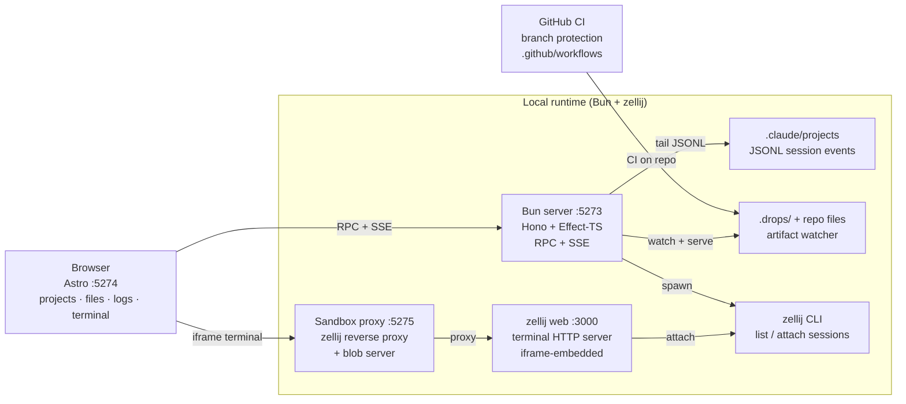

<p align="center">
  <strong>🛳 pier</strong>
  <br/>
  <em>Browser-based dashboard for local and remote Claude Code agent sessions</em>
  <br/><br/>
  
  
  
  
  
  
</p>

## Why pier?

Agentic coding tools are powerful, but their default interface is narrow: session context is spread across terminals, JSONL logs, generated artifacts, and editor windows. When running multiple agents, it is hard to see what is active, what changed, and where attention is needed. `pier` turns the agent harness into an observable control plane — a browser workspace that embeds zellij terminals, streams live Claude Code events, and surfaces generated artifacts, all without replacing the CLI workflows that make agentic development productive.

## Features

- **Live agent activity** — server-sent event stream sourced from Claude Code (`~/.claude/projects/**/*.jsonl`) with per-session filtering and history replay.
- **Embedded terminal** — zellij sessions rendered inside the browser via zellij's built-in HTTP server and pier's reverse proxy; sessions survive browser reloads.
- **Artifact browser** — `.drops/` directory and tracked repo files are watched, served through a blob server, and viewable in-page.
- **Project picker** — discovers zellij-managed repositories from a configurable `PIGUY_PROJECTS_ROOT` directory.
- **End-to-end type safety** — backend exports `AppType` from Hono; frontend imports a typed `hc<AppType>` client via `packages/api-contract`; zero codegen.
- **Spec-driven workflow** — every change to production code lands through a TDD spec pipeline (`/do <intent>`) documented in `AGENTS.md`.

## Quick start

```sh
bun install
bun --filter @pier/backend dev    # API server :5273  (sandbox :5275)
bun --filter @pier/frontend dev   # Astro dashboard  :5274 — open in browser
```

## Installation

### Prerequisites

| Requirement | Version | Notes |
|-------------|---------|-------|
| [Bun](https://bun.sh) | ≥ 1.3.6 | `packageManager` field in `package.json` |
| [zellij](https://zellij.dev) | any | Required for terminal embedding; must have web server enabled |
| [Claude Code CLI](https://docs.anthropic.com/en/docs/claude-code) | any | Optional — needed for live agent event streams |

### Steps

```sh
# 1. Clone the repository
git clone https://github.com/pierre-mike/pier.git
cd pier

# 2. Install dependencies (all workspaces)
bun install

# 3. Start the backend
bun --filter @pier/backend dev

# 4. In a second terminal, start the frontend
bun --filter @pier/frontend dev

# 5. Open http://localhost:5274 in your browser
```

## Usage

### Launch the dashboard

```sh
bun --filter @pier/backend dev   # keep running
bun --filter @pier/frontend dev  # open http://localhost:5274
```

### Browse drops and artifacts

Artifacts written to `~/.pi/artifacts/` or `.drops/` in any project are automatically watched by the backend and available in the Files panel. Select a project in the sidebar, then click any file to view it in the embedded viewer.

### View live Claude activity

The Logs panel streams tool calls, agent events, and errors from all active Claude Code sessions. It reads from `~/.claude/projects/**/*.jsonl` (configurable via `PIGUY_CLAUDE_PROJECTS_ROOT`). History is pre-loaded on open; new events arrive over SSE without polling.

### Embed a terminal

```sh
# zellij must be running with its web server enabled
zellij --web-server
```

Select a project in the dashboard sidebar. Pier spawns or attaches to the corresponding zellij session and renders it in an iframe via the reverse proxy at `:5275`.

## Architecture

Pier follows a **Functional Core / Imperative Shell** split. The Bun + Hono backend is layered as `core/` (pure logic) → `infra/` (Effect services for filesystem, zellij, Claude events) → `shell/` (Hono routes + SSE). The Astro frontend imports a fully-typed Hono RPC client from `packages/api-contract`; no codegen is required.

For the interactive canvas view, open `pier-architecture.canvas` in Obsidian.



## Project structure

```text
pier/
├── apps/
│   ├── backend/              # Bun + Hono + Effect-TS API server
│   │   └── src/
│   │       ├── core/         # Pure business logic (no I/O)
│   │       ├── infra/        # Effect services: fs, zellij, Claude events, SSE bus
│   │       └── shell/        # Hono routes + Effect.gen coordinators
│   │           ├── api.ts    # Route registry — exports AppType for RPC
│   │           └── routes/   # One file per route group
│   └── frontend/             # Astro dashboard
│       └── src/
│           ├── components/   # Astro components
│           ├── dashboard/    # Vanilla TS modules: store, projects, files, logs, terminal
│           ├── layouts/      # Astro layouts
│           ├── pages/        # Astro pages
│           └── styles/       # CSS
├── packages/
│   └── api-contract/         # Typed Hono RPC client (auto-derived from AppType)
├── scripts/                  # Spec pipeline tooling (spec-complete, tasks-verify, …)
├── specs/                    # Spec lifecycle: active/, archive/, constitution.md
├── AGENTS.md                 # Agent harness rules + architecture reference
├── PRD.md                    # Product requirements and roadmap
├── biome.json                # Biome linter + formatter config
├── lefthook.yml              # Git hooks (biome, typecheck, colocated tests, gitleaks)
├── pier-architecture.canvas  # Obsidian architecture canvas
├── turbo.json                # Turborepo task pipeline
└── package.json              # Root workspace + scripts
```

## Configuration

All configuration is read from environment variables at startup. Defaults suit a macOS developer machine.

| Variable | Default | Description |
|----------|---------|-------------|
| `PIGUY_PORT` | `5273` | Backend API server port |
| `PIGUY_SANDBOX_PORT` | `5275` | Sandbox proxy port (zellij reverse proxy + blob server) |
| `PIGUY_ZELLIJ_URL` | `https://127.0.0.1:8082` | zellij web server URL |
| `PIGUY_PROJECTS_ROOT` | `~/Github` | Root directory scanned for projects |
| `PIGUY_PI_ROOT` | `~/.pi` | pi data directory |
| `PIGUY_ARTIFACTS_DIR` | `~/.pi/artifacts` | Artifact drop directory watched by backend |
| `PIGUY_CLAUDE_PROJECTS_ROOT` | `~/.claude/projects` | Claude Code session logs directory |

The frontend resolves the backend URL through `PUBLIC_API_URL` (set in wrangler.toml per-environment). In local dev (`astro dev`) it falls back to `http://localhost:8787` — do not set `PUBLIC_API_URL` at the wrangler root `[vars]` level or it will override local dev.

## Development

All commands run from the repo root.

| Command | Description |
|---------|-------------|
| `bun run dev` | Turbo dev — all workspaces in parallel |
| `bun run build` | Turbo build (cached, dependency-aware) |
| `bun run test` | Turbo test (cached) |
| `bun run typecheck` | Turbo typecheck (cached) |
| `bun run lint` | Biome check + auto-fix across the entire monorepo |
| `bun run check` | Full pipeline: `typecheck → lint → test → spec:lint` |
| `bun run spec:lint` | Validate spec frontmatter, dep cycles, and gate existence |
| `bun run tasks:verify` | Run every active spec's gate + boundary checks |
| `bun run spec:complete <slug>` | Verify → tick tasks → archive spec → commit |

Pre-commit hooks (Lefthook) run automatically on `git commit`:

1. Biome auto-fix + re-stage
2. TypeScript typecheck via `turbo typecheck`
3. Co-located test enforcement
4. Secret scanning (gitleaks)

CI order: `type-check → biome ci → test → secret-scan → build` — each stage blocks the next.

## Contributing

pier uses a **spec-first workflow**: every change to production code (`apps/**`, `packages/**`, `.github/**`) starts as a spec in `specs/active/`. No direct commits to `main`.

- **How the workflow works** — see [`AGENTS.md`](AGENTS.md): spec authoring, the `/do` dispatch chain (spec-tester → spec-judge → spec-implementer), worktree conventions, and route authoring rules.
- **Repo invariants** — see [`specs/constitution.md`](specs/constitution.md): no `any`, no `as` casts outside tests, colocated tests, protected paths.
- **To propose a change** — run `/do <intent>` in Claude Code. The pipeline authors a spec, writes RED tests, implements to GREEN, and opens a PR with auto-merge.
- **CI, CODEOWNERS, branch rules** — see [`.github/INTERNAL.md`](.github/INTERNAL.md).

## License

License: TBD (`license` field absent from `package.json`).

## Acknowledgements

pier is built on the shoulders of:

- [Bun](https://bun.sh) — runtime, package manager, and test runner
- [Hono](https://hono.dev) — fast, typed HTTP framework with RPC support
- [Effect-TS](https://effect.website) — typed errors, dependency injection, and concurrency
- [Astro](https://astro.build) — frontend framework for the dashboard
- [Turborepo](https://turbo.build) — monorepo task pipeline and caching
- [Biome](https://biomejs.dev) — linter and formatter
- [zellij](https://zellij.dev) — terminal multiplexer with web server support
- [Claude Code](https://docs.anthropic.com/en/docs/claude-code) — agentic coding CLI whose sessions pier observes and embeds
- [Cloudflare Workers](https://workers.cloudflare.com) — backend deploy target (Hono runs on V8 isolates)
